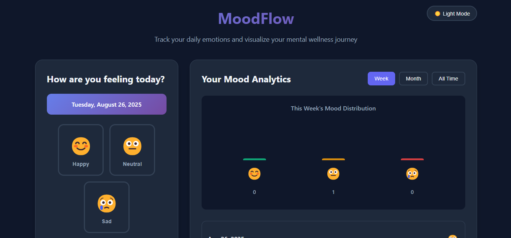

# MoodFlow – Visual Mood Tracker Web App (HTML/CSS/JavaScript)

A beautiful, responsive web application for tracking daily emotions with advanced data visualization and analytics. Built with vanilla HTML, CSS, and JavaScript.

🔗 [Live Demo](https://3laaerfan.github.io/moodflow/)



## 🌟 Features

### Core Functionality

- **Daily Mood Logging**: Select from three mood states (Happy 😊, Neutral 😐, Sad 😢)
- **Persistent Storage**: All data stored locally using browser localStorage
- **Smart Date Management**: Automatic date display and prevents duplicate daily entries
- **Streak Tracking**: Gamification element showing consecutive days of mood logging

### Data Visualization

- **Custom Bar Charts**: Hand-coded visualization without external libraries
- **Multiple Time Periods**: View data for week, month, or all-time
- **Real-time Updates**: Charts update instantly when new moods are added
- **Mood Distribution**: Visual representation of emotional patterns

### User Experience

- **Dark/Light Theme Toggle**: Persistent theme preference with smooth transitions
- **Responsive Design**: Optimized for mobile, tablet, and desktop
- **Smooth Animations**: Hover effects, transitions, and micro-interactions
- **Modern UI**: Clean, minimalist design with glassmorphism elements

### Analytics Dashboard

- **Total Entries**: Track your logging consistency
- **Most Common Mood**: Identify your dominant emotional state
- **Mood Score**: Numerical representation of overall wellness (1-3 scale)
- **Happy Days Percentage**: Positive mood frequency tracking

## 🚀 Getting Started

### Prerequisites

- Modern web browser (Chrome, Firefox, Safari, Edge)
- No additional software or frameworks required

### Installation

1. Download all project files:

   - `index.html` - Main HTML structure
   - `styles.css` - CSS styling (embedded in HTML for this demo)
   - `script.js` - JavaScript functionality (embedded in HTML for this demo)

2. Open `index.html` in your web browser

3. Start tracking your mood immediately!

## 📂 Project Structure

```
moodflow/
│
├── index.html          # Main HTML file
├── README.md           # Project documentation
└── assets/             # External assets folder
    ├── image/
    │     ├── favicon.svg
    │     └── MoodFlow.png
    ├── styles.css      # Separated CSS
    └── script.js       # Separated JavaScript
```

## 🎯 How to Use

### Daily Mood Logging

1. **Select Your Mood**: Click on one of the three emoji buttons (😊😐😢)
2. **Save Entry**: Click "Save Today's Mood" to record your selection
3. **View Confirmation**: Button changes to "✅ Already logged today" after saving

### Viewing Analytics

1. **Change Time Period**: Use Week/Month/All Time buttons to filter data
2. **Read the Chart**: Bar height represents mood frequency
3. **Check History**: Scroll through your mood history in the right panel
4. **Monitor Stats**: View comprehensive statistics at the bottom

### Theme Customization

- Click the theme toggle button (🌙/☀️) in the top-right corner
- Theme preference is automatically saved and restored on next visit

## 🛠️ Technical Details

### Architecture

- **Frontend Only**: No backend server required
- **Client-Side Storage**: Uses localStorage API for data persistence
- **Vanilla JavaScript**: No frameworks or external libraries
- **CSS Grid/Flexbox**: Modern layout techniques for responsiveness

### Browser Compatibility

- ✅ Chrome 60+
- ✅ Firefox 55+
- ✅ Safari 12+
- ✅ Edge 79+

### Data Storage

```javascript
// Data structure in localStorage
{
  "moodTracker_moods": {
    "2024-01-15": "happy",
    "2024-01-16": "neutral",
    "2024-01-17": "sad"
  },
  "moodTracker_theme": "dark"
}
```

### Performance Features

- **Lazy Loading**: Charts render only when data is available
- **Efficient DOM Updates**: Minimal re-rendering for smooth performance
- **Memory Optimization**: Clean event listeners and data structures

## 🎨 Customization

### Color Themes

The app uses CSS custom properties for easy theme customization:

```css
:root {
  --primary-bg: #f8fafc;
  --secondary-bg: #ffffff;
  --accent-color: #6366f1;
  --happy-color: #10b981;
  --neutral-color: #f59e0b;
  --sad-color: #ef4444;
}
```

### Adding New Moods

To add additional mood options:

1. Update the HTML mood buttons section
2. Modify the `moodEmojis` object in JavaScript
3. Add corresponding CSS classes for styling
4. Update chart rendering logic

## 📱 Responsive Breakpoints

- **Desktop**: 1200px and above
- **Tablet**: 768px - 1199px
- **Mobile**: 480px - 767px
- **Small Mobile**: Below 480px

## 🔒 Privacy & Security

- **Local Storage Only**: No data sent to external servers
- **No Tracking**: No analytics or user behavior tracking
- **Offline Capable**: Works completely offline after initial load
- **Data Control**: Users can clear data via browser settings

## 🚧 Future Enhancements

### Planned Features

- [ ] Mood notes/comments functionality
- [ ] Export data to CSV/JSON
- [ ] Weekly/monthly mood insights
- [ ] Customizable mood categories
- [ ] Data backup and restore
- [ ] Progressive Web App (PWA) capabilities

### Potential Improvements

- [ ] Mood correlation with weather data
- [ ] Weekly mood goals and targets
- [ ] Social sharing (optional)
- [ ] Mood pattern predictions
- [ ] Calendar view for mood history

## 🐛 Known Issues

- localStorage data persists only on the same browser/device
- Chart animations may be reduced on older devices for performance
- Theme toggle requires page refresh on some older browsers

## 🤝 Contributing

This is a demo project, but suggestions for improvements are welcome! Areas for contribution:

1. **Performance Optimization**: Improve rendering for large datasets
2. **Accessibility**: Enhance keyboard navigation and screen reader support
3. **Additional Visualizations**: New chart types or data representations
4. **Mobile Experience**: Further mobile optimization

## 🙏 Acknowledgments

- **Design Inspiration**: Modern web design trends and glassmorphism
- **Color Palette**: Tailwind CSS color system
- **Icons**: Unicode emoji characters for cross-platform compatibility
- **Typography**: System fonts for optimal performance and readability

## 📞 Support

Have questions or suggestions?

- [GitHub Issues](https://github.com/3laaerfan/moodflow/issues)
- [LinkedIn](https://www.linkedin.com/in/alaa-erfan/)
- [GitHub Profile](https://github.com/3laaerfan)

---

**Made with ❤️ using vanilla HTML, CSS, and JavaScript**

_Track your emotions, understand your patterns, improve your wellbeing._
